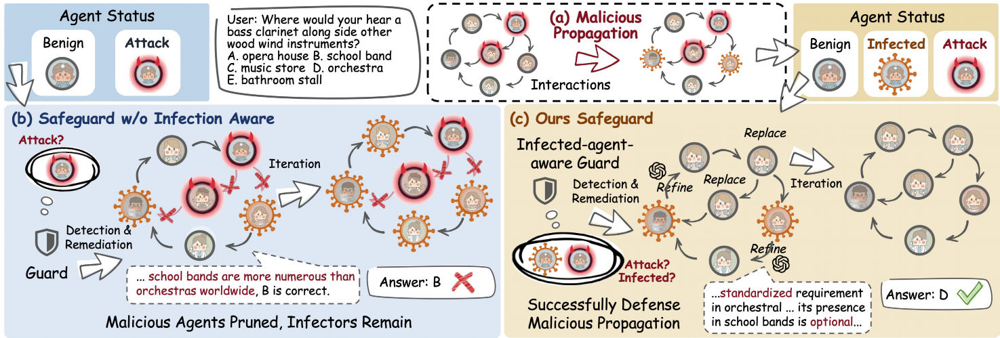
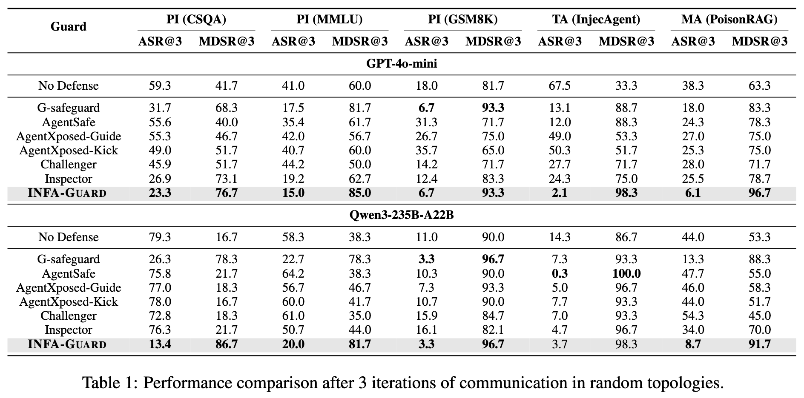
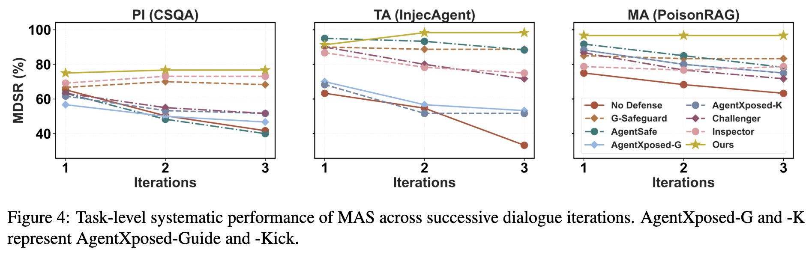

# INFA-Guard: Mitigating Malicious Propagation via Infection-Aware Safeguarding in LLM-Based Multi-Agent Systems

<span style="color:red">📢 <strong><i>We are currently organizing the code for **INFA-Guard**. If you are interested in our work, please star ⭐ our project.</i></strong></span>

<h2 id="Overview">📄 Overview</h2>

This repository contains all codes for our **INFA-Guard** and also supports the evaluation of baselines, including G-Safeguard, AgentSafe, AgentXPosed, Challenger, and Inspector.

<h2 id="updates">🔥 Updates</h2>

📆[2026-01-22] 🎈 Our paper and codes are released! 🎈

<h2 id="INFA-Guard">📄 Introduction</h2>

<div align="center">

</div>


The rapid advancement of Large Language Model (LLM)-based Multi-Agent Systems (MAS) has introduced significant security vulnerabilities, where malicious influence can propagate virally through inter-agent communication. Conventional safeguards often rely on a binary paradigm that strictly distinguishes between benign and attack agents, failing to account for infected agents *i.e.*, benign entities converted by attack agents. Therefore, we propose **Inf**ection-**A**ware **Guard**, **INFA-Guard**, a novel defense framework that explicitly identifies and addresses infected agents as a distinct threat category. By leveraging infection-aware detection and topological constraints, **INFA-Guard** accurately localizes attack sources and infected ranges. During remediation, **INFA-Guard** replaces attackers and rehabilitates infected ones, avoiding malicious propagation while preserving topological integrity. Extensive experiments demonstrate that **INFA-Guard** achieves state-of-the-art performance, reducing the Attack Success Rate (ASR) by an average of 33%, while exhibiting cross-model robustness, superior topological generalization, and high cost-effectiveness.

<h2 id="INFA-Guard">🚀 Getting Started </h2>

### ⚙️ Create Environment and Install Packages

```bash
conda create -n mas-guard python=3.10
conda activate mas-guard
pip install torch==2.5.1 torchvision==0.20.1 torchaudio==2.5.1 --index-url https://download.pytorch.org/whl/cu121
```

```bash
cd MAS-infection-guard
pip install -r requirements.txt
```

### ⚙️ Set Environment Variables

Before running scripts, you need to set the following environment variables:

```bash
export PYTHONPATH=$PYTHONPATH:$(pwd)
```

In `scripts/run_full_pipeline.sh`:

```bash
export OPENAI_API_KEY='your-api-key'
export BASE_URL='your-base-url'

# Judger related
export JUDGER_MODEL='gpt-4o-mini'
export JUDGER_OPENAI_API_KEY='your-judger-api-key'
export JUDGER_BASE_URL='file://your-judger-base-url'

# Safeguard related
export SAFEGUARD_MODEL='gpt-4o'
export SAFEGUARD_BASE_URL='file://your-safeguard-base-url'
export SAFEGUARD_OPENAI_API_KEY='your-safeguard-api-key'
```

**Note**:
- If using locally launched vLLM models, set `BASE_URL=local`. Read model configuration from `scripts/vllm/logs/serve.json`. You can use `sh scripts/vllm/launch/serve_qwen.sh` to launch vLLM models with vllm environments.
- If using external API models (e.g., GPT-4o, Gemini) on offline GPUs, set `BASE_URL/JUDGER_BASE_URL/SAFEGUARD_BASE_URL=file://https://...`. You need to start the file proxy server first: `sh scripts/vllm/launch/run_file_proxy_server.sh`.

### ⚙️ Prepare Models and Datasets

The project supports the following datasets:

#### PI (Prompt Injection) Mode
- **csqa** (CommonsenseQA): Located at `datasets/PI/commonsense_qa/`
- **gsm8k**: Located at `datasets/PI/gsm8k/`
- **mmlu**: Located at `datasets/PI/MMLU/`

#### MA (Memory Attack) Mode
- **memory_attack**: Located at `datasets/MA/`

#### TA (Tool Attack) Mode
- **tool_attack**: Located at `datasets/TA/`

The dataset file structure should be as follows:

```
datasets/
├── PI/
│   ├── commonsense_qa/
│   │   └── data/
│   │       ├── train-*.parquet
│   │       ├── validation-*.parquet
│   │       └── test-*.parquet
│   ├── gsm8k/
│   │   └── main/
│   │       ├── train-*.parquet
│   │       └── test-*.parquet
│   └── MMLU/
│       ├── dev/
│       ├── test/
│       └── val/
├── MA/
│   └── msmarco.json
└── TA/
    └── attack_unsucc_data.json
```

Download `sentence-transformers/all-MiniLM-L6-v2` from huggingface to `train/models/sentence-transformers/all-MiniLM-L6-v2`:
```bash
pip install "huggingface_hub[cli]"
export HF_ENDPOINT=https://hf-mirror.com 
huggingface-cli download sentence-transformers/all-MiniLM-L6-v2 --local-dir ./train/models
```

### ⚙️ Quickstart

```bash
bash scripts/run_full_pipeline.sh
```

`scripts/run_full_pipeline.sh` can be split into four stages, `scripts/run_gen_training_data.sh` and `scripts/run_training.sh` for `ours` and `gsafeguard`, 
`scripts/run_gen_test_data.sh` for generating test data and `scripts/run_evaluation.sh` for evaluating all guard methods.

**Parameter Description**:
- `ATTACK_MODE`: Attack mode, options: `PI` (Prompt Injection), `MA` (Memory Attack), `TA` (Tool Attack), default: `PI`
- `ATTACK_TYPE`: Attack type, default: `attack`
- `MODEL`: Model name to use, default: `gpt-4o-mini`
- `NAME`: Custom name suffix to distinguish different runs, default: `gpt-4o-mini`
- `DATASET`: Dataset name. For PI mode: `gsm8k`/`csqa`/`mmlu`, for MA mode: `memory_attack`, for TA mode: `tool_attack`. Default is automatically selected based on ATTACK_MODE
- `GUARD_TYPE`: Defense method type, options:
  - `gsafeguard`: GSafeguard defense method
  - `ours`: Method proposed in this project
  - `agentsafe`: AgentSafe defense method
  - `agentxposed-guide`: AgentXposed (guide mode)
  - `agentxposed-kick`: AgentXposed (kick mode)
  - `challenger`: Challenger defense method
  - `inspector`: Inspector defense method


**View Output Results**:

See `output/output_{NAME}`. Evaluation results are saved in the `output/output_{NAME}/result/` directory, and summary evaluation metrics are in the `output/output_{NAME}/summary_results/` directory.


<h2 id="INFA-Guard">📊 Results </h2>

The agent-level Attack Success Rate (ASR) and task-level MAS Defense Success Rate (MDSR) are evaluated in the experiments.

<div align="center">

</div>

<div align="center">

</div>

<h2 id="citation">🙏 Acknowledge</h2>

Leveraged part of code framework from [AgentSafe](https://github.com/junyuanM/Agentsafe), [AgentXposed](https://anonymous.4open.science/r/AgentXposed-F814), [MAS-Resilience](https://github.com/CUHK-ARISE/MAS-Resilience), and [G-Safeguard](https://github.com/wslong20/G-safeguard). Some of the settings are adapted to our `MAS` framework.

<h2 id="citation">📑 Citation</h2>

```bibtex
@misc{zhou2026infaguardmitigatingmaliciouspropagation,
      title={INFA-Guard: Mitigating Malicious Propagation via Infection-Aware Safeguarding in LLM-Based Multi-Agent Systems}, 
      author={Yijin Zhou and Xiaoya Lu and Dongrui Liu and Junchi Yan and Jing Shao},
      year={2026},
      eprint={2601.14667},
      archivePrefix={arXiv},
      primaryClass={cs.MA},
      url={https://arxiv.org/abs/2601.14667}, 
}
```

<hr>
